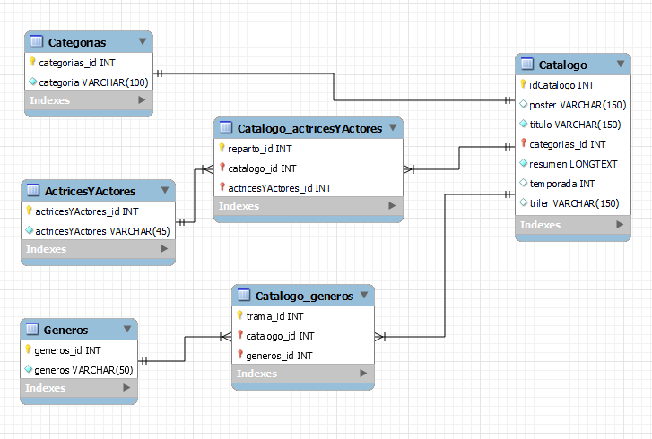

# Entrega final de Argentina Programa 4.0 - BACKEND

## Aplicacion CRUD - Trilerflix

este proyecto nos permite ver, crear, modificar y eliminar datos en una base de datos en este caso "Trilerflix" desde Postman o Thunderclient mediante solicitudes.

### las tecnologias que se utilizaron fueron:

Javascript
Express
NodeJS
Sequelize
MySQL Worckbenck

### links

DRIVE:
[https://drive.google.com/drive/folders/1hz2xdgYn-SvvjlzvM-aSVD1TWWLbSTG7?usp=drive_link]

en este link podemos encontrar los archivos:

Trilerflix.json : es el JSON donde tenemos la informacion

Trilerflix-esquema.mwb : es el planteo de tablas y sus asociaciones de manera grafica, este podemos visualizarlo desde MySQL Workbench desde la pestaña Models

modelo fisico:



Trilerflix-BBDD.sql : es el archivo con el cual podremos instalar la base de datos, tablas, datos y una vista general similar al objeto JSON en MySQL Workbench

### Instalación

desde la consola vamos a trabajar en el siguiente orden:

1. Clona este repositorio:

git clone https://github.com/urldelproyecto...

2. Navega al directorio del proyecto:

cd posts...

3. Instala las dependencias:

npm install

4. Inicia el servidor:

npm start

La API estará disponible en http://localhost:3000.

### configuraciones previas

ya que se utiliza el archivo .gitignore veo recomendable espesificar los archivos que se omiten que serian:

#### .env

la forma en que se debe redactar este es la siguiente:

DB_SCHEMA = 'trilerflix'
DB_USER = 'root'
DB_PASSWORD = '**\*\*\***'
DB_HOST = 'localhost'
DB_PORT = '300\*'

ALERT: esto es solo un ejemplo, se debe reemplazar los valores!

## ENDPOINTS

## Catalogo: donde encontraremos los datos relacionados de series y peliculas es decir de la tabla Catalogo

### para SOLICITAR CATALOGO COMPLETO:

- url: /api/catalogo
- metodo: GET

### para BUSCAR POR ID:

- url: /api/buscarPOS/:ID
- metodo: GET

### para BUSCAR POR NOMBRE:

- url: /api/buscarPOS/nombre/:nombre
- metodo: GET

### para BUSCAR POR CATEGORIA:

- url: /api/buscarPOS/categoria/:categoria
- metodo: GET

### para BUSCAR POR GENERO:

- url: /api/buscarPOS/genero/:genero
- metodo: GET

### para CREAR CATALOGO:

- url: /api/crearPOS
- metodo: POST

CUERPO DE LA PETICION

```javascript
{
    "poster":"Ejem",
    "titulo":"Ejem",
    "categoria_id":"1",
    "resumen":"Ejem",
    "temporada":"1",
    "triler":"Ejem",
}
```

### para ACTUALIZAR CATALOGO:

- url: /api/actualizarPOS/:id
- metodo: PUT

CUERPO DE LA PETICION

```javascript
{
    "poster":"Ejem",
    "titulo":"Ejem",
    "categoria_id":"1",
    "resumen":"Ejem",
    "temporada":"1",
    "triler":"Ejem",
}
```

### para ELIMINAR POR ID:

- url: /api/elimnarPOS/:id
- metodo: DELETE

## Generos: donde encontraremos los datos relacionados de los generos existentes y sus id

### para SOLICITAR TODOS LOS GENEROS:

- url: /api/generos
- metodo: GET

### para BUSCAR POR ID:

- url: /api/genero/:id
- metodo: GET

### para CREAR GENERO:

- url: /api/crearGenero
- metodo: GET

CUERPO DE LA PETICION

```javascript
{
    "tipoDeGenero":"Ejemplo",
}
```

### para ACTUALIZAR GENERO:

- url: /api/actualizarGenero
- metodo: PUT

CUERPO DE LA PETICION

```javascript
{
    "tipoDeGenero":"Ejemplo",
}
```

### para ELIMINAR GENERO:

- url: /api/eliminarGenero
- metodo: DELETE

## ActricesYActores:donde encontraremos los datos relacionados de los actores existentes y sus id

### para solicitar TODOS LOS ACTORES:

- url: /api/actricesYActores
- metodo: GET

### para BUSCAR POR ID:

- url: /api/actricesYActores/:id
- metodo: GET

### para CREAR ACTORES:

- url: /api/crearActricesYActores
- metodo: POST

CUERPO DE LA PETICION

```javascript
{
    "nombreCompleto":"Ejemplo",
}
```

### para ACTUALIZAR ACTORES:

- url: /api/actualizarActricesYActores/:id
- metodo: PUT

CUERPO DE LA PETICION

```javascript
{
    "nombreCompleto":"Ejemplo",
}
```

### para ELIMINAR ACTORES:

- url: /api/eliminarActricesYActores/:id
- metodo: DELETE

## Categorias: donde encontraremos los datos relacionados de las categorias existentes y sus id

### para solicitar TODAS LAS CATEGORIAS:

- url: /api/categorias
- metodo: GET

### para BUSCAR POR ID:

- url: /api/categoria/:id
- metodo: GET

### para CREAR categorias:

- url: /api/crearCategoria
- metodo: POST

CUERPO DE LA PETICION

```javascript
{
    "categoria":"Ejemplo",
}
```

### para ACTUALIZAR CATEGORIA:

- url: /api/actualizarCategoria/:id
- metodo: put

CUERPO DE LA PETICION

```javascript
{
    "categoria":"Ejemplo",
}
```

### para ELIMINAR CATEGORIA:

- url: /api/eliminarCategoria/:id
- metodo: DELETE

## tambien tenemos: las relaciones donde encontraremos el reparto y la trama

### Catalogo_actricesYActores: donde encontraremos los datos relacionados de los actores y las peliculas y series existentes y sus id

### para SOLICITAR EL REPARTO:

- url: /api/repartoDePOS
- metodo: GET

### para CREAR REPARTO:

- url: /api/crearReparto
- metodo: POST

CUERPO DE LA PETICION

```javascript
{
    "catalogo_id":"1",
    "actricesYActores_id":"5",
}
```

### para ACTUALIZAR RELACION:

- url: /api/actualizarReparto/:id
- metodo: PUT

CUERPO DE LA PETICION

```javascript
{
    "catalogo_id":"Ejemplo: 1",
    "actricesYActores_id":"Ejemplo: 5",
}
```

### para ELIMINAR RELACION:

- url: /api/eliminarReparto/:id
- metodo: DELETE

## Catalogo_generos: donde encontraremos los datos relacionados de las peliculos y series los generos existentes y sus id

### para solicitar TODAS LAS TRAMAS:

- url: /api/tramaDePOS
- metodo: GET

### para CREAR TRAMA:

- url: /api/crearTrama
- metodo: POST

CUERPO DE LA PETICION

```javascript
{
    "catalogo_id":"Ejemplo",
    "generos_id":"Ejemplo",
}
```

### para ACTUALIZAR TRAMA:

- url: /api/actualizarTrama/:id
- metodo: PUT

CUERPO DE LA PETICION

```javascript
{
    "catalogo_id":"Ejemplo",
    "generos_id":"Ejemplo",
}
```

### para ELIMINAR TRAMA:

- url: /api/eliminarTrama/:id
- metodo: DELETE

## Errores

La API devuelve mensajes de error con los códigos de estado correspondientes en caso de que ocurran problemas. Asegúrate de manejar adecuadamente estos errores en tu aplicación cliente.

## Conclusiones

Esta es una API de ejemplo que utiliza Node.js, Express y Sequelize para gestionar posts, comentarios, usuarios, etiquetas y categorías. Puedes utilizar esta API como base para desarrollar tu propia aplicación web o móvil. Asegúrate de personalizarla según tus necesidades específicas y de implementar la seguridad y la autorización adecuadas para proteger tus recursos.
